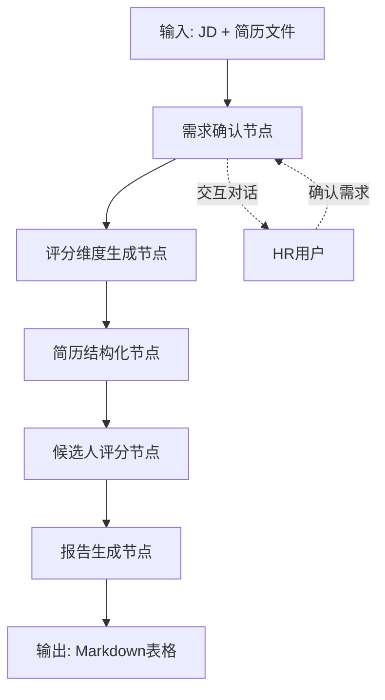

# HR智能体简历筛选系统设计方案

## 系统概述
基于LangGraph构建的多智能体HR简历筛选系统，通过智能对话确认招聘需求，自动解析简历，生成个性化评分维度，并输出结构化的候选人对比分析表格。

## 核心节点架构

### 1. 需求确认节点 (RequirementConfirmationNode)
**功能：**
- 基于用户提供的JD，与HR进行交互对话
- 收集并确认招聘需求的三个维度：
  - 必要条件 (Must-have)
  - 加分条件 (Nice-to-have) 
  - 排除条件 (Deal-breaker)
- 自主判断信息收集完整性
- 生成标准化的requirements清单

**输入：** JD文本
**输出：** 结构化的招聘需求清单
**特点：** 可独立运行，可集成到其他workflow

### 2. 评分维度生成节点 (ScoringDimensionNode)
**功能：**
- 基于需求确认节点的输出，生成个性化评分维度
- 自动分配各维度权重
- 为不同职位类型优化评分标准
- 生成10分制评分框架

**输入：** 招聘需求清单
**输出：** 个性化评分维度和权重配置
**特点：** 动态生成，适应不同职位需求

### 3. 简历结构化节点 (ResumeStructureNode)
**功能：**
- 异步批量处理多份简历
- 将简历内容发送给LLM进行结构化总结
- 提取关键信息：基本信息、技能、经验、教育背景等
- 统一数据格式，便于后续处理

**输入：** 多份简历文件 (PDF/Word/Text)
**输出：** 结构化的候选人信息列表
**特点：** 异步处理，支持批量操作

### 4. 候选人评分节点 (CandidateEvaluationNode)
**功能：**
- 基于生成的评分维度对候选人进行10分制评分
- 自动匹配候选人信息与职位要求
- 生成详细的评分理由和标记 (✓/⚠️/❌)
- 计算综合得分

**输入：** 结构化候选人信息 + 评分维度配置
**输出：** 每个候选人的详细评分结果
**特点：** 基于个性化维度，精准评分

### 5. 报告生成节点 (ReportGenerationNode)
**功能：**
- 将评分结果转换为Markdown格式表格
- 动态生成表格行（基于评分维度）
- 添加视觉标记和格式化
- 支持候选人排序和对比

**输入：** 所有候选人评分结果
**输出：** Markdown格式的对比表格
**特点：** 动态表格生成，直观对比

## 工作流程设计



## 数据结构设计

### 招聘需求清单 (JobRequirement)
```python
{
    "position": "Senior Backend Developer",
    "must_have": [
        "5+ years Node.js experience",
        "PostgreSQL expertise",
        "Microservices architecture"
    ],
    "nice_to_have": [
        "Fintech background",
        "Team leadership experience",
        "AWS certification"
    ],
    "deal_breaker": [
        "Less than 3 years experience",
        "No database experience"
    ]
}
```

### 评分维度配置 (ScoringDimensions)
```python
{
    "basic_info": {"weight": 0.1, "fields": ["name", "experience", "education"]},
    "technical_skills": {"weight": 0.4, "fields": ["nodejs", "postgresql", "microservices"]},
    "domain_experience": {"weight": 0.3, "fields": ["fintech", "performance", "compliance"]},
    "soft_skills": {"weight": 0.2, "fields": ["leadership", "communication", "github"]}
}
```

### 候选人信息 (CandidateProfile)
```python
{
    "name": "Sarah Chen",
    "basic_info": {...},
    "technical_skills": {...},
    "experience": [...],
    "education": [...],
    "scores": {
        "technical_skills": 8.5,
        "domain_experience": 7.0,
        "soft_skills": 6.5,
        "overall": 7.8
    }
}
```

## 技术架构

### 核心框架
- **LangGraph**: 工作流编排和节点管理
- **LangChain**: LLM交互和提示工程
- **Pydantic**: 数据验证和类型检查
- **AsyncIO**: 异步处理支持

### 节点设计原则
1. **可复用性**: 每个节点可独立运行
2. **可扩展性**: 支持新节点的添加
3. **异步处理**: 提高批量处理效率
4. **错误处理**: 完善的异常处理机制

### 输出格式
- **主要输出**: Markdown表格格式
- **辅助输出**: JSON结构化数据
- **可视化**: 支持HTML表格导出

## 系统特点

1. **交互式需求确认**: 智能对话收集精确需求
2. **动态评分维度**: 根据职位自动生成评分标准
3. **批量异步处理**: 高效处理多份简历
4. **个性化评分**: 基于具体需求的精准评分
5. **直观对比输出**: Markdown表格便于查看和分享

## 扩展能力

1. **节点可插拔**: 支持新功能节点的添加
2. **评分模型可替换**: 支持不同评分算法
3. **多语言支持**: 可扩展多语言简历处理
4. **API接口**: 支持外部系统集成

这个设计方案是否符合您的需求？有需要调整的地方吗？